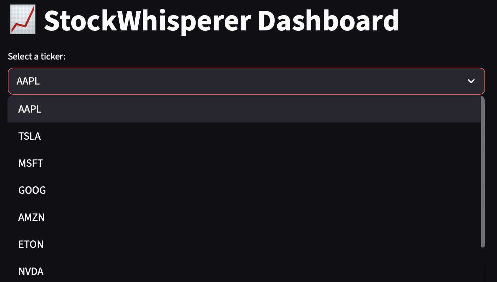
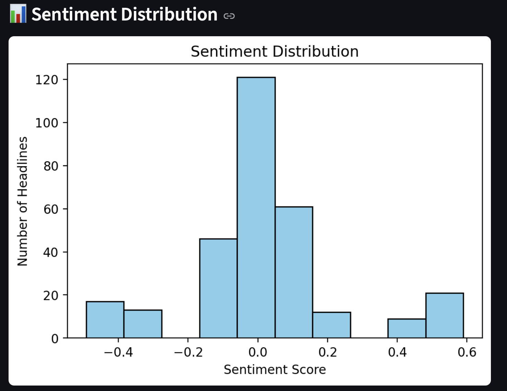
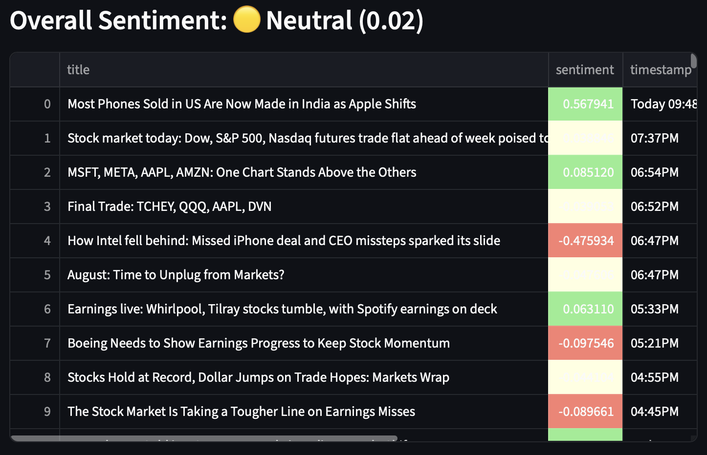

# StockWhisperer

StockWhisperer is a personal project I built to explore web scraping, sentiment analysis, and data visualization in finance.  
It scrapes the latest stock headlines from Finviz, analyzes their sentiment, stores the results in SQLite,  
and displays everything in an interactive dashboard built with Streamlit.

I wanted to build something that felt like a real product while also showing my skills with Python, SQL, NLP, and dashboards.

---

## Features

✅ Scrapes stock headlines for multiple tickers (AAPL, TSLA, MSFT, GOOG, AMZN, etc.)  
✅ Performs sentiment analysis using TextBlob  
✅ Saves everything into a SQLite database  
✅ Interactive Streamlit dashboard with:
   - Average sentiment summary (Positive / Negative / Neutral)
   - Color-coded table of headlines
   - Sentiment trend line chart
   - Sentiment distribution histogram  

✅ Cron job to run scraper daily (automation)  
✅ Optional script to backfill fake 30-day history for testing

---

## 🛠 Tech Stack

- **Python** (requests, BeautifulSoup, pandas, matplotlib)
- **SQLite** for local database storage
- **TextBlob** for basic sentiment analysis
- **Streamlit** for the interactive dashboard
- **Cron + schedule** for automation

---

## 📂 Project Structure

Stock_News_Whisperer/ 
│── screenshots/  
│   ├── dashboard.png  
│   ├── sentiment_chart.png  
│   ├── sentiment_distribution.png  
│   ├── table_view.png  
│── scraping/  
│ └── yahoo_scraper.py # Scrapes Finviz headlines & saves to DB  
│── db/  
│ └── stockwhisperer.db # SQLite database  
│── dashboard.py # Streamlit dashboard  
│── backfill_data.py # Creates fake 30-day history for testing  
│── main.py # Menu to run scraper, dashboard, or backfill  
│── README.md  

## 📸 Screenshots

### Dashboard Preview

### Sentiment Trend

### Sentiment Distribution

### Headlines Table

## How to Run Locally

# Clone repo
git clone https://github.com/your-username/StockWhisperer.git
cd StockWhisperer

# Create virtual environment
python3 -m venv venv
source venv/bin/activate

# Install dependencies
pip install -r requirements.txt

# Run scraper (fetch latest headlines)
python scraping/yahoo_scraper.py

# Run dashboard
streamlit run dashboard.py

# Automation
- To automatically scrape news every day at 8 AM, I set up a cron job:
0 8 * * * cd ~/StockWhisperer && source venv/bin/activate && python scraping/yahoo_scraper.py

## Future Improvements
- Avoid duplicates when scraping
- Use VADER or FinBERT for better financial sentiment analysis
- Deploy dashboard to Streamlit Cloud for public access
- Add stock price charts alongside sentiment trends

## What I Learned
This project helped me improve my skills in:

- Writing clean, modular Python code
- Working with SQLite databases
- Automating tasks with cron and schedule
- Building user-friendly dashboards with Streamlit

## Author
Built by Thapelo Clement as a personal portfolio project. 
I wanted something practical that shows my ability to go from data collection -> analysis -> visualization.
